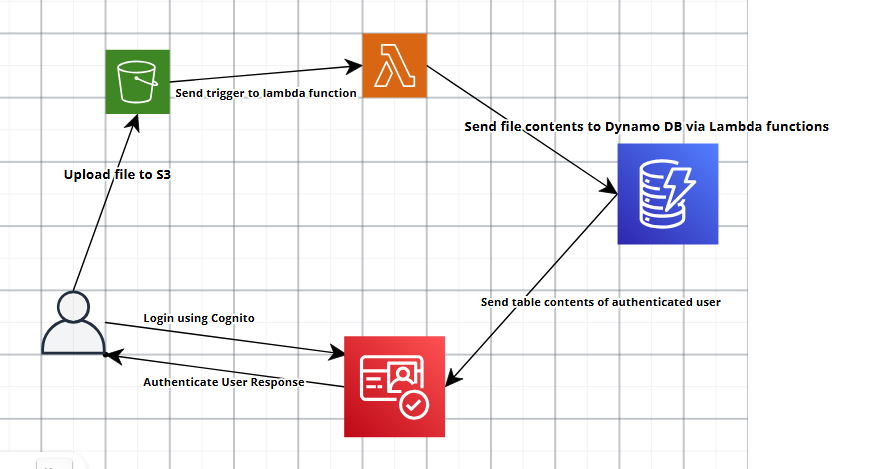

## Getting Started with the Project

- The idea is to build a simple application using AWS Cognito, AWS S3, AWS DynamoDB and AWS Lambda
- User uploads file to S3
- Uploaded files of .txt format sends  a trigger to update the Dynamo DB.
- User authenticates via Cognito to get the list of records from the table.

### ARCHITECTURE DIAGRAM

### Dependencies

- Packages installed via [npm](./package.json)
- Create a .env file to store API keys
  - **REACT_APP_USER_POOL_ID** - Cognito user Pool ID
  - **REACT_APP_CLIENT_ID** - Auth App Client ID
  - **REACT_APP_AWS_REGION** - AWS Region
  - **REACT_APP_AWS_S3_BUCKET** - S3 bucket name
  - **REACT_APP_IDENTITY_POOL_ID** - ID pool Id

### Executing the project

- Run `npm install` to install all required packages
- Run `npm start` to execute the React project

